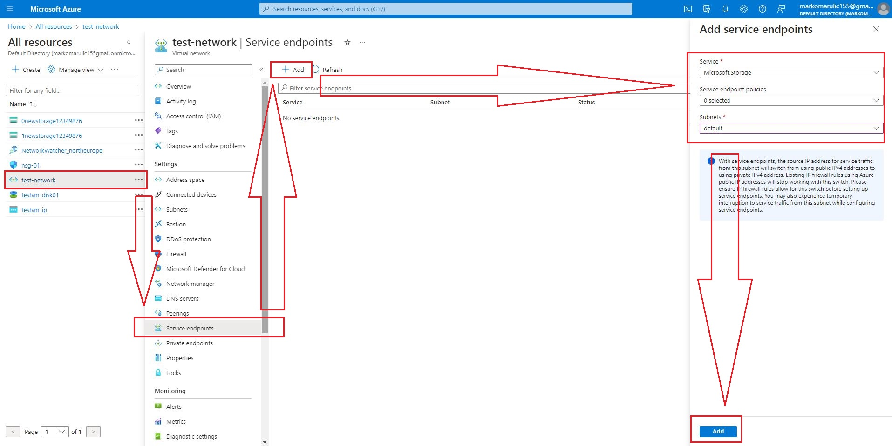
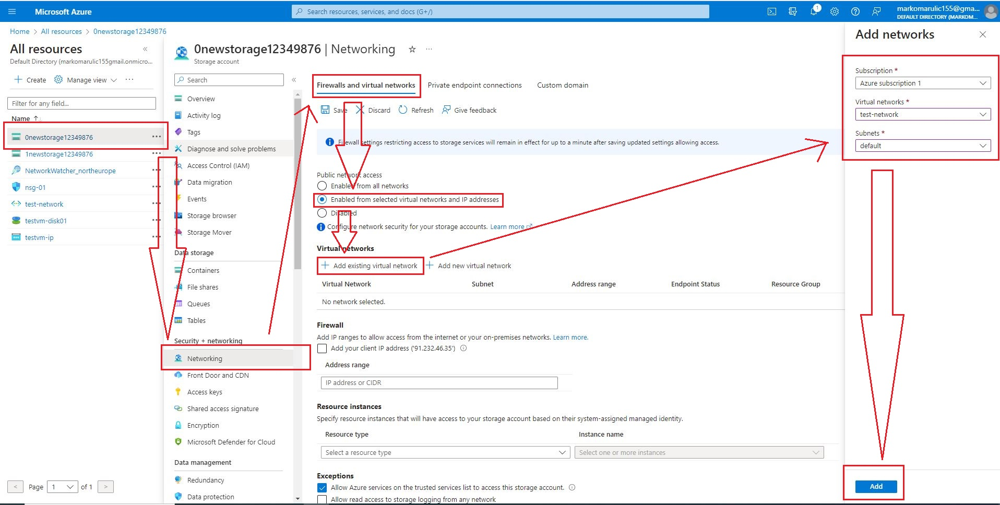

# Azure Infrastructure Setup Guide
This guide provides step-by-step instructions to deploy a Windows Server VM, set up Azure Storage accounts, configure networking, and enable secure access using service endpoints to Azure Storage Explorer.

Azure infrastructure in this project has been provisioned using Bicep, a domain-specific language for defining Azure resources.

## Deployment Steps
### 1. Create two resource groups
- use provided Bicep file to create two resource groups, one for VM deployment, another for Storage Accounts deployment
### 2. Deploy a Windows Server VM
- use provided Bicep file to deploy Windows Server VM with all nessesary resources (vnet, publicIP, nic, nsg) in first recource group
### 3. Deploy Two Storage Accounts
- use provided Bicep file to deploy two storage accounts in second resource group
### 4. RDP to VM and Install Azure Storage Explorer
- use Remote Desktop Protocol (RDP) to connect to the deployed Windows Server VM using its public IP address
- inside the VM, download and install [Azure Storage Explorer](https://azure.microsoft.com/en-us/products/storage/storage-explorer)
- launch Azure Storage Explorer and sign in to each storage account using their respective access keys
### 5. Configure Virtual Network and Service Endpoint
- in the Azure Portal, go to the Virtual networks section, select the virtual network associated with the deployed VM, navigate to Service endpoints and add a service endpoint for Microsoft.Storage

### 6. Modify Networking for Selected VNETs on Storage Account
- go to the Storage accounts section in the Azure Portal, choose one of the storage accounts and navigate to Networking
- modify the Public network access settings to enable access only for selected VNets and add the deployed VM's VNet to the list of selected VNets

### 7. Accessing Data via Azure Storage Explorer
- From the Windows Server VM:
  - launch Azure Storage Explorer from the Windows Server VM, authenticate using your Azure credentials
  - access the storage accounts, and as the VM is within the specified VNet with a service endpoint, it can securely communicate with the storage accounts via Azure's backbone network
- From a Local Laptop:
  - access attempts from a local laptop to the storage accounts will be denied by default
  - the secure access setup, which confines access only to the specified VNets, restricts direct access from external sources, such as a local laptop
  - this configuration ensures that only resources within the designated VNet, specifically the deployed VM, can interact with the storage accounts via Azure's backbone network
