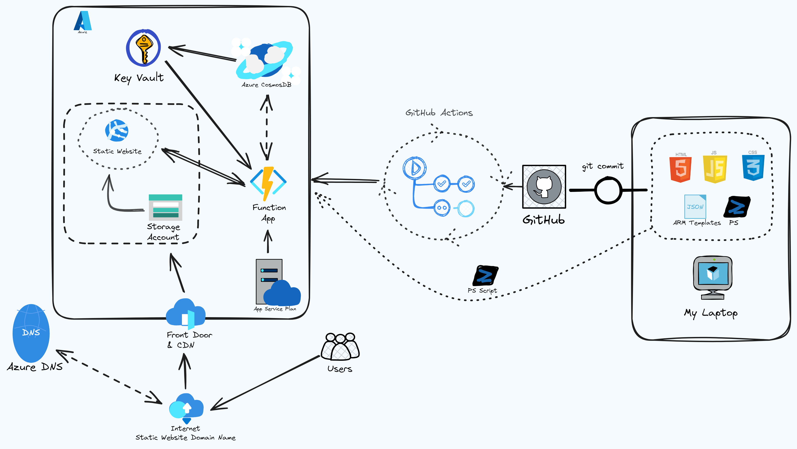

# Personal Website Project
This project is my personal website, developed using basic HTML, CSS, and JavaScript.

It leverages Azure services extensively for deploying the front-end, back-end, and tracking visitor counts on the website.

## Azure Services Utilized
- CosmosDB
- KeyVault
- Storage account
- DNS
- CDN
- Function App

### Deployment
- The website is hosted online as an Azure Storage static website
- Azure Storage website URL uses HTTPS via Azure CDN for enhanced security

### Domain Configuration
- Custom DNS domain name points to the Azure CDN endpoint, established through Azure DNS service

### Visitor Counter
- Implemented a visitor counter using JavaScript to display site access count
- The counter retrieves and updates its count in a Table API within Azure CosmosDB using serverless capacity mode

### Functionality and Database Communication
- Azure Functions with an HTTP trigger API handle requests from the website
- These functions communicate with the database, serving as an intermediary between the frontend JavaScript code and Azure CosmosDB

### Testing
- JavaScript code includes tests using Jest to ensure functionality and reliability

### Infrastructure as Code (IaC)
- Leveraging ARM templates for deploying Azure resources
  - CosmosDB
  - KeyVault
  - Storage account
  - DNS
  - CDN
  - Function App

# CI/CD
- Utilizing GitHub Actions for Continuous Integration (CI) and Continuous Deployment (CD) of the backend, specifically for the function app code